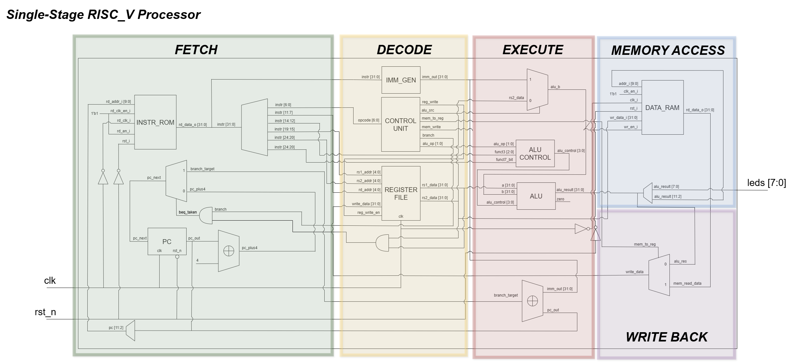

# Single-Cycle RISC-V SoC Implementation Phase 1

This repository contains the Verilog HDL implementation of a **Single-Cycle RISC-V Processor** optimized for the Lattice **CertusPro-NX (LFCPNX-100)** FPGA using Lattice Radiant.

[!Phase1_Core](./images/architecture.png)

## 🚀 Key Features

* **Architecture**: Single-cycle data path with Fetch, Decode, Execute, Memory, and Write-Back stages.

* **Instruction Support**: Implements primary RISC-V Integer (RV32I) instruction formats, including R-type, I-type (Load/ADDI), S-type (Store), and B-type (Branch).

* **Timing Optimized**:
    * **Fast Branching**: Bypasses the 32-bit ALU carry chain for `BEQ` decisions by using direct register comparison.

    * **Pre-calculated ALU**: Reduces logic depth by parallelizing arithmetic operations.

* **Registered I/O**: The LED outputs are synchronized via a dedicated register stage to decouple physical pin delay from core logic.

* **Clock Management**: Built-in PLL scaling for stable operations.

---

## 🛠 Hardware Infrastructure (Lattice IP)

To ensure physical stability and meet timing requirements on the CertusPro-NX, the design utilizes specific Lattice Semiconductor IP blocks:

1. **PLL (Phase-Locked Loop)**:
* **Module**: `pll_clock` 

* **Function**: Converts the on-board **125 MHz** crystal oscillator signal into a stable **40 MHz** system clock (`cpu_clk`).

* **Safety**: Utilizing the `lock_o` signal to ensure the RISC-V core only begins execution after the clock signal has stabilized.

2. **EBR (Embedded Block RAM)**:
* **Module**: `data_ram` 

* **Configuration**: High-performance synchronous RAM mapped to specific FPGA primitives (SP16K).

* **Clocking**: Driven by the inverted system clock (`~cpu_clk`) to provide the ALU half a cycle to stabilize memory addresses.

---

## 📂 Design Hierarchy

* `system_top.v`: Top-level module integrating the RISC-V core, PLL, ROM, and RAM .

* `riscv_top.v`: Internal CPU architecture connecting the stages .

* `alu.v`: Optimized 32-bit Arithmetic Logic Unit .

* `register_file.v`: 32 x 32-bit general-purpose register bank .

* `control_unit.v` & `alu_control.v`: Main decoder and arithmetic steering logic .

* `imm_gen.v`: Immediate value generator for I, S, and B type instructions .

* `instr_rom.v`: Instruction memory initialized via `.mem` file .

---

## 📈 Performance Benchmarks

By analyzing the **Map Report** and **Power Calculator** results, the physical implementation on the **LFCPNX-100** is summarized below:

| Metric | Measured Value | Analysis |
| --- | --- | --- |
| **Max Operating Frequency ($F_{max}$)** | **45.03 MHz** | Optimized for the 40MHz system clock target. |
| **Total LUT4 Usage** | **581** | Efficient logic mapping (mostly within `u_core`). |
| **PFU Registers** | **21** | Minimal sequential overhead; primary storage in RegFile. |
| **Distributed RAM** | **192** | Register file implemented via LUT-RAM for speed. |
| **Embedded Block RAM (EBR)** | **2** | Efficient use of SP16K primitives for ROM/RAM. |
| **Total Power Consumption** | **45.0 mW** | Ultra-low power profile suitable for edge deployment. |
| **Core Dynamic Power** | **5.0 mW** | Power consumed specifically by logic switching. |

---

## 🔧 Tools Used

* **Synthesis & Implementation**: Lattice Radiant Software (v2025.1.0)
* **Device**: LFCPNX-100-8LFG672C (CertusPro-NX)
* **Synthesis Engine**: Lattice Synthesis Engine (LSE)

---

### 🚀 Phase 2: Professional Single-Cycle SoC

* **RV32I Full Compliance**: Complete implementation of all 47 base integer instructions and validation against the RISC-V Architectural Test Suite.
* **Privileged Spec Support**: Integration of Machine-mode Control and Status Registers (CSRs) for performance monitoring and basic exception handling.
* **Wishbone Interconnect**: Transitioning to a standardized Wishbone bus fabric to allow "plug-and-play" peripheral integration.
* **Advanced Peripherals**: Implementation of a 16550-compatible UART for serial communication and a 64-bit Machine Timer.
* **Verification Rigor**: Expanding the SystemVerilog environment to include Constrained Random Verification (CRV) and Functional Coverage.

